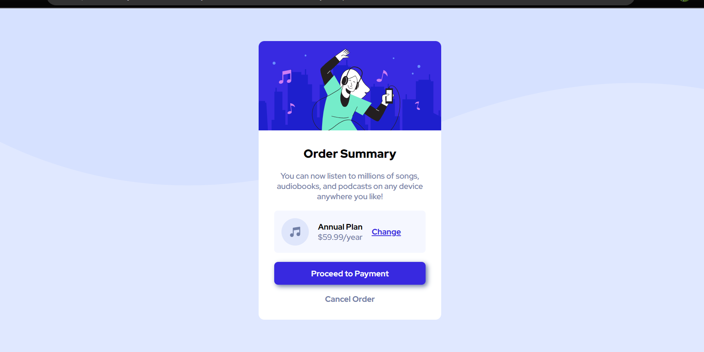

# Frontend Mentor - Order summary card solution

This is a solution to the [Order summary card challenge on Frontend Mentor](https://www.frontendmentor.io/challenges/order-summary-component-QlPmajDUj). Frontend Mentor challenges help you improve your coding skills by building realistic projects. 

## Table of contents

- [Overview](#overview)
  - [The challenge](#the-challenge)
  - [Screenshot](#screenshot)
  - [Links](#links)
- [My process](#my-process)
  - [Built with](#built-with)
  - [What I learned](#what-i-learned)
  - [Continued development](#continued-development)
  - [Useful resources](#useful-resources)
- [Author](#author)
- [Acknowledgments](#acknowledgments)

**Note: Delete this note and update the table of contents based on what sections you keep.**

## Overview

### The challenge

Users should be able to:

- See hover states for interactive elements

### Screenshot




**Note: Delete this note and the paragraphs above when you add your screenshot. If you prefer not to add a screenshot, feel free to remove this entire section.**

### Links

- Solution URL: [Add solution URL here](https://your-solution-url.com)
- Live Site URL: [Add live site URL here](https://your-live-site-url.com)

## My process

### Built with

- Semantic HTML5 markup
- CSS custom properties
- Flexbox
- CSS Grid


### What I learned

I learned flexbox more clearly and specifically.
I learned how to use diffrent background images using css. 
I learned to use css variables.
I learned to use async to load fonts asynchonously.
I learned to use fallback font as sans serif, in case if the google fonts fails to load.
I learned to use transition on button for smooth hovering. 

To see how you can add code snippets, see below:

```css
:root {
  --pale-blue: hsl(225, 100%, 94%);
  --bright-blue: hsl(245, 75%, 52%);
  --bg-white: #fff;

  --very-pale-blue: hsl(225, 100%, 98%);
  --desaturated-blue: hsl(224, 23%, 55%);
  --dark-blue: hsl(223, 47%, 23%);

  --normal-font-weight: 500;
  --bold-font-weight: 700;
  --bolder-font-weight: 900;
}
```

**Note: Delete this note and the content within this section and replace with your own learnings.**

### Continued development

I want to continue with flexbox as I am not yet very good at it.

### Useful resources

- Youtube
- Pluralsite
- w3school


## Author

- Frontend Mentor - [@yourusername](https://www.frontendmentor.io/profile/DhobaleAnjali)


